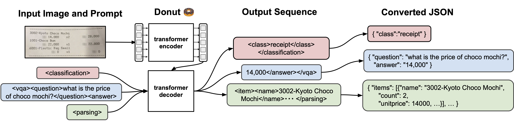

<div align="center">
    
# Donut 🍩 : Document Understanding Transformer

[](#demo)
[](#demo)

Implementation of Donut

</div>

## Introduction

**Donut** 🍩, **Do**cume**n**t **u**nderstanding **t**ransformer, is a new method of document understanding that utilizes an OCR-free end-to-end Transformer model. Donut does not require off-the-shelf OCR engines/APIs, yet it shows state-of-the-art performances on various visual document understanding tasks, such as visual document classification or information extraction (a.k.a. document parsing).



## Pre-trained Model and Web Demo

Gradio web demo is available! [](#demo) [](#demo)
|:--:|
||
- You can run the demo with `./app.py` file.
- Images are not uploaded due to the privacy issue.
- Web demo is available from the link in the following table.

|Task|Sec/Img|Score|Trained Model|<div id="demo">Demo</div>|
|---|---|---|---|---|
| [Insurance] (Document Parsing)   |   0.7 |  91.3 | [donut-base-finetuned-insurance](https://huggingface.co/RustX/donut-base-finetuned-insurance) | [gradio space web demo](https://huggingface.co/spaces/RustX/donut-base-finetuned-insurance),<br>[google colab demo](https://colab.research.google.com/drive/1HRof7YZBsdJB3BEu-4PSOlRZH60vX1O8?usp=sharing) |

## Getting Started

### Data

This repository assumes the following structure of dataset:
```bash
> tree dataset_name
dataset_name
├── test
│   ├── metadata.jsonl
│   ├── {image_path0}
│   ├── {image_path1}
│             .
│             .
├── train
│   ├── metadata.jsonl
│   ├── {image_path0}
│   ├── {image_path1}
│             .
│             .
└── validation
    ├── metadata.jsonl
    ├── {image_path0}
    ├── {image_path1}
              .
              .

> cat dataset_name/test/metadata.jsonl
{"file_name": {image_path0}, "ground_truth": "{\"gt_parse\": {ground_truth_parse}, ... {other_metadata_not_used} ... }"}
{"file_name": {image_path1}, "ground_truth": "{\"gt_parse\": {ground_truth_parse}, ... {other_metadata_not_used} ... }"}
     .
     .
```

- The structure of `metadata.jsonl` file is in [JSON Lines text format](https://jsonlines.org), i.e., `.jsonl`. Each line consists of
  - `file_name` : relative path to the image file.
  - `ground_truth` : string format (json dumped), the dictionary contains either `gt_parse` or `gt_parses`. Other fields (metadata) can be added to the dictionary but will not be used.
- `donut` interprets all tasks as a JSON prediction problem. As a result, all `donut` model training share a same pipeline. For training and inference, the only thing to do is preparing `gt_parse` or `gt_parses` for the task in format described below.
